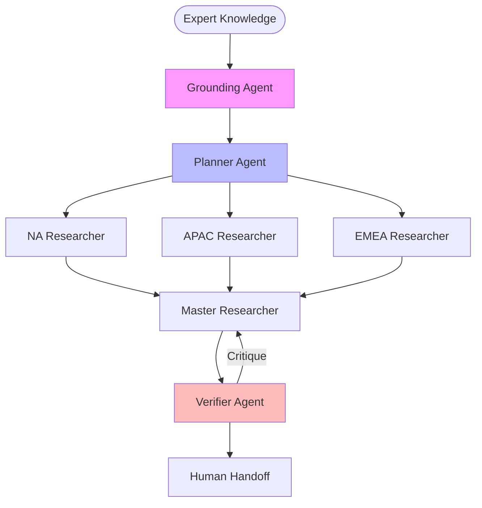

# 🔬 Advanced Research: CDP

## 🏗️ Dynamic Orchestration Logic Summary
| Step | Reason for Handoff | Next Agent |
| :--- | :--- | :--- |
| 1 | World-View Grounding: Scanning expert docs for contradictions. | 🧠 Planner |
| 2 | Strategic Plan: Assigned parallel tasks to Regional Agents. | 🌍 Regional Agents (Parallel) |
| 3 | Synthesis: Merging regional findings into global report. | 🔍 Master Researcher |
| 4 | Audit Triggered: Depth check initiated via Cynical Auditor. | ⚖️ Verifier |
| 5 | Self-Correction: Researcher addressing auditor feedback. | 🔍 Master Researcher |
| 6 | Final Review: Logic verified; human handoff ready. | 🏁 Finish |

> **Human-in-the-loop Note:** Final stage identifies gaps requiring internal enterprise data.

## 🗺️ Agent Orchestration Trace

## 🏆 Multi-Agent vs. Single-Agent Benchmarks
| Capability | Traditional Single-Agent | This MAS System |
| :--- | :--- | :--- |
| **Global Nuance** | Generic / US-Centric | Regional Parallel Analysts |
| **Error Handling** | Linear / No-Correction | Self-Correcting Loop |
| **Grounding** | Hallucinated | Hard-Anchored to Expert Docs |

## 📝 Final Deep Research Output
To enhance the clarity and impact of the report analyzing the Carbon Disclosure Project (CDP) in North America and Customer Data Platforms (CDPs) in the APAC and EMEA regions, the following refinements are suggested based on the audit:

1. **Audience Specification and Grounding:**
   - Clearly identify and segment the intended audience, such as policymakers, business leaders, or investors, in the introduction. Explain how each group can utilize the report's insights to guide policy-making, drive strategic business decisions, or inform investment strategies. Consider a preface or an executive summary that provides context and purpose tailored to these specific user groups.

2. **Clarified Objectives and Scope:**
   - Define the report's specific objectives and key questions in the introductory section. Offer a succinct outline of the insights and conclusions that readers should expect by the end of the document. This will focus readers' attention and set clear expectations.

3. **Balanced Detail Across Sections:**
   - Ensure consistency in the depth of analysis for both the North American CDP and the APAC/EMEA CDPs. Expand Part B with comprehensive case studies or examples, providing equal weight and analysis as in Part A, to maintain a cohesive narrative across regions.

4. **Minimization of Assumptions with Explanations:**
   - Provide concise explanations or a glossary for terms like ESG criteria, GDPR, and CDP functionality to enhance accessibility. This will allow readers with varying levels of familiarity to fully understand the report without needing prior expertise.

5. **Integration and Interrelation of Sections:**
   - Establish connections between the separate sections on CDP and CDPs to highlight global trends in data usage for sustainability and business growth. Include a comparative analysis or draw insights from parallels and contrasts observed across regions.

6. **Actionable Recommendations and Future Outlook:**
   - Augment projections and trends with clear, actionable recommendations. Offer strategies or steps for stakeholders to apply the insights effectively in their fields, translating theoretical knowledge into practical applications.

7. **Enhanced Data Presentation through Visual Aids:**
   - Integrate charts, graphs, and tables to depict data and trends visually. These visual aids will improve comprehension and retention, break the text's monotony, and succinctly summarize key findings, making the report more engaging.

8. **Specific Challenges and Practical Solutions:**
   - Provide specific, real-world examples of challenges faced by organizations and how they overcame them. Suggest practical solutions and strategies companies could implement, supported by case studies or success stories to enrich this section’s value.

By implementing these refinements, the report will offer a coherent, actionable, and audience-centered analysis, enhancing communication, relevance, and practical applicability for its readers.
---
## 🕵️ Unresolved Doubts & Expert Handoffs
To refine the report further and ensure comprehensive insights, the following three missing data points would benefit from human internal access:

1. **Current Stakeholder Feedback and Insights:**
   - Collect feedback from target audience members such as policymakers, business leaders, and investors who have previously engaged with similar reports or data. This could involve access to interviews or surveys that provide firsthand insights into their expectations and how they have previously used such reports. Understanding their needs would help tailor the content more effectively to each group, ensuring that the objectives of the report align with actual stakeholder challenges and priorities.

2. **Recent Case Studies and Regional Data:**
   - Acquire access to specific case studies or data sets that highlight recent successful implementations of CDPs in both the North American and APAC/EMEA regions. Internal knowledge of organizational experiences, particularly in terms of the strategies they implemented, the challenges they faced, and the outcomes achieved, is essential for strengthening the report's analysis and recommendations. This would include nuanced details regarding the implementation of sustainable data practices or organizational responses to ESG criteria across different regions.

3. **Up-to-Date Market Research and Trends:**
   - Access the latest market research reports and industry analyses that provide insights on emerging trends in sustainability, data privacy regulations (like GDPR), and the performance of CDPs across various sectors. This should include consultation with internal teams or departments that monitor market developments and regulatory changes to provide the most relevant and timely context for the recommendations and insights shared in the report. The aim here is to ensure that the report reflects the current landscape and anticipates future developments that could impact stakeholders’ decisions.