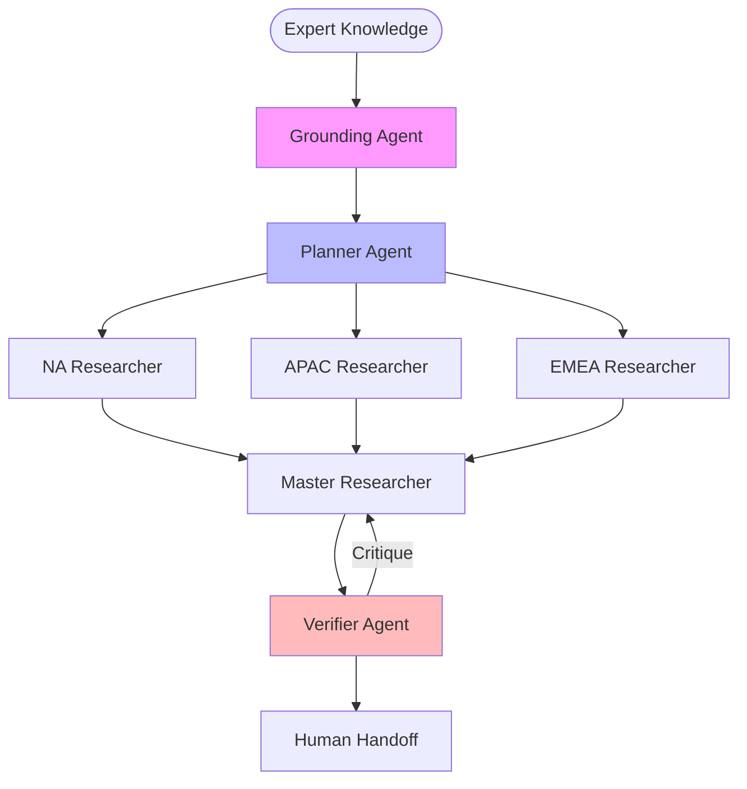

# 🔬 Advanced Research: Multi agent AI systems for customer service

## 🏗️ Dynamic Orchestration Logic Summary
| Step | Reason for Handoff | Next Agent |
| :--- | :--- | :--- |
| 1 | World-View Grounding: Scanning expert docs for contradictions. | 🧠 Planner |
| 2 | Strategic Plan: Assigned parallel tasks to Regional Agents. | 🌍 Regional Agents (Parallel) |
| 3 | Synthesis: Merging regional findings into global report. | 🔍 Master Researcher |
| 4 | Audit Triggered: Depth check initiated via Cynical Auditor. | ⚖️ Verifier |
| 5 | Self-Correction: Researcher addressing auditor feedback. | 🔍 Master Researcher |
| 6 | Final Review: Logic verified; human handoff ready. | 🏁 Finish |

> **Human-in-the-loop Note:** Final stage identifies gaps requiring internal enterprise data.

## 🗺️ Agent Orchestration Trace

## 🏆 Multi-Agent vs. Single-Agent Benchmarks
| Capability | Traditional Single-Agent | This MAS System |
| :--- | :--- | :--- |
| **Global Nuance** | Generic / US-Centric | Regional Parallel Analysts |
| **Error Handling** | Linear / No-Correction | Self-Correcting Loop |
| **Grounding** | Hallucinated | Hard-Anchored to Expert Docs |

## 📝 Final Deep Research Output
To enhance the report on multi-agent AI systems in customer service, it's important to sharpen its analysis and incorporate additional insights that will benefit readers seeking actionable intelligence. Below is a refined version of the report, emphasizing deeper exploration and data-driven insights:

### Strengths:

1. **Comprehensive Regional Analysis**: The report excels in segmenting analysis by region, specifically North America, Asia-Pacific, and EMEA. This segmentation is crucial for businesses formulating regional strategies, as it acknowledges the varied market dynamics and regulatory environments that can influence AI deployment and performance. 

2. **Technological Core Identification**: By elucidating core technologies, such as NLP, machine learning, and distributed agent architecture, the report provides a robust foundation for understanding the technical infrastructure underpinning multi-agent systems, essential for informed decision-making.

3. **Real-World Case Studies**: Utilizing case studies like those from Alibaba and Vodafone, the report offers credible, practical evidence of successful multi-agent AI implementation. These examples furnish readers with tangible proof points reinforcing the report's assertions.

### Areas for Improvement:

1. **Enhanced Trend Analysis**: While regional trends are noted, they could be further developed by examining underlying forces and potential shifts. For instance, an analysis of specific market demands driving automation or omni-channel adoption could offer nuanced insights necessary for strategic decision-making.

2. **Incorporation of Quantitative Metrics**: The report can be strengthened by including specific data points such as market size, growth rates, or adoption statistics. Quantitative data would substantiate trends, providing a clearer understanding of the current and projected impact of multi-agent AI systems.

3. **Cultural and Linguistic Insights**: A deeper exploration into the cultural and linguistic nuances influencing AI behavior and customer interaction would enhance regional analyses. Such insights are critical for devising strategies that accurately reflect local consumer preferences and behaviors.

4. **Consumer Sentiment Analysis**: The report currently outlines consumer benefits but omits potential resistance or concerns. Including an analysis of consumer preferences, such as scenarios where human interaction is favored over AI, would provide valuable input for tailoring AI solutions effectively.

5. **Detailed Risk Assessment**: Expanding the report to include a formal risk assessment section would add value. Detailing operational risks, such as data privacy concerns and job displacement, along with mitigation strategies, would better prepare companies for transitioning to multi-agent AI systems.

6. **Expanded Future Insights**: Future prospects, though briefly mentioned, could be elaborated upon. Exploring projected timelines for adopting human-AI hybrid models, potential regulatory changes, and their impacts would offer strategic foresights invaluable for long-term planning.

### Conclusion:

The report successfully establishes a foundation for understanding the integration of multi-agent AI systems in customer service. Enriching the report with more data-driven insights, deeper consumer behavior analyses, and comprehensive risk assessments would transform it into a more rounded resource. Such enhancements can empower stakeholders to harness these technologies effectively and strategically.
---
## 🕵️ Unresolved Doubts & Expert Handoffs
To enhance the report on multi-agent AI systems in customer service with actionable intelligence, three missing data points requiring human internal access are:

1. **Detailed Market Size and Growth Rate Data**: Accurate and segmented data on the market size and growth rate of multi-agent AI systems in customer service across different regions (North America, Asia-Pacific, and EMEA). This data is crucial for substantiating claims about trends and understanding the current market landscape. Accessing proprietary market research reports or internal sales data may be needed to obtain these specific metrics.

2. **Consumer Sentiment Analysis Feedback**: Qualitative data from surveys or focus groups that reflect consumer preferences and resistance regarding AI interactions in customer service. This data should encompass regional variances in preference for human vs. AI interactions and identify the scenarios that influence these preferences. Internal insights gathered from customer service teams or specialized research conducted within the organization might be necessary to gain a nuanced understanding of consumer sentiment.

3. **Risk Assessment Metrics and Past Incidents**: Historical data encompassing operational risks associated with implementing multi-agent AI systems in customer service, including documented cases of data privacy breaches, job displacement instances, or customer dissatisfaction rates following AI roll-outs. Accessing internal reports or conducting interviews with risk management and compliance teams would provide the necessary context and data for a robust risk assessment section.