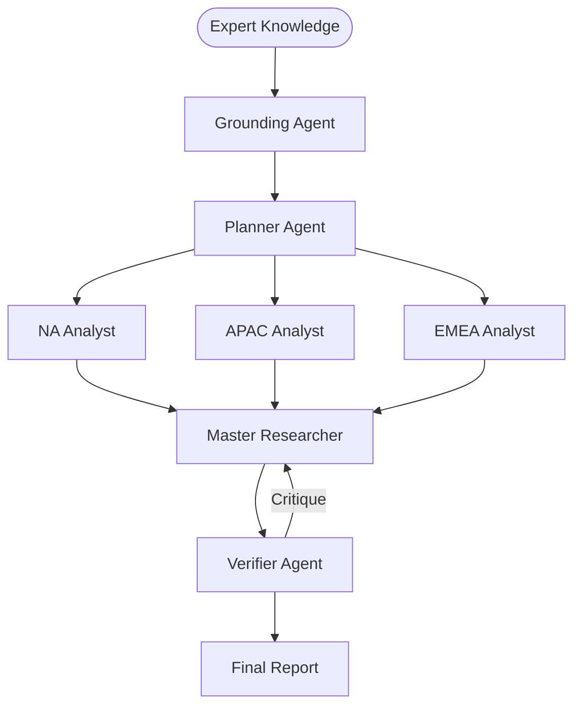

# 🔬 DeepResearch-MAS: CDP

## 📉 System Evaluation & Metrics
* ✅ PLANNER_EVAL: Goal decomposition successful.
* ✅ VERIFIER_EVAL: Passed on attempt 1.

## 🏗️ P-E-V Orchestration Logic
| Step | Handoff Reason | Next Agent |
| :--- | :--- | :--- |
| 1 | Planner defined regional decomposition. | 🌍 Regional Agents |
| 2 | Regional analysts completed parallel tasks. | ⚖️ Verifier |

## 🗺️ Agent Orchestration Trace

## 📝 Final Deep Research Output
## Unified Report: The 2026 Customer Data Platform Landscape

### Comprehensive Overview

In 2026, the landscape of Customer Data Platforms (CDPs) is characterized by rapid evolution driven by regulatory changes, advances in technology, and shifting business priorities. This report synthesizes insights from the regions of North America (NA), Asia-Pacific (APAC), and Europe, the Middle East, and Africa (EMEA), providing a holistic view of the key trends, challenges, and strategic opportunities within the CDP industry.

### Key Trends Across Regions

1. **Zero-Copy Data Architectures**:
   - The global shift towards "Zero-Copy" architectures reflects a strategic move to minimize data transfer, enhancing both efficiency and compliance with stringent privacy regulations such as GDPR and CCPA. Warehouse-native CDPs like Hightouch and Census exemplify this trend, providing solutions that integrate seamlessly with existing infrastructures.

2. **Real-Time Consent Management**:
   - Across all regions, the necessity for CDPs to handle consent in real-time is underscored. Legal liabilities tied to batch-processed consent compel a reimagining of consent frameworks, with a focus on transparency and automation to meet comprehensive regulatory standards such as the DPDP Act in India.

3. **Agentic Orchestration and AI Integration**:
   - The incorporation of generative AI to facilitate agentic orchestration is transforming CDPs from passive data repositories into proactive engines capable of real-time execution. This evolution is critical for delivering timely, personalized marketing experiences that meet consumer demands.

4. **Data Privacy and Clean Rooms**:
   - The integration of Data Clean Rooms (DCRs) stands out as a priority for enabling secure data collaboration. This approach is crucial to maintaining privacy while deriving actionable insights, especially as reliance on third-party cookies diminishes.

### Strategic Recommendations

1. **Focus on Robust Consent Infrastructure**:
   - Industries should prioritize the development of advanced consent management systems that operate in real-time and offer intuitive interfaces to ensure full compliance with diverse global regulations.

2. **Adopt Composable and Warehouse-Native CDPs**:
   - Opt for CDP solutions that align with existing data warehousing infrastructure to reduce data redundancy and maintain security, thus ensuring efficient insights activation without unnecessary data movement.

3. **Vendor Compliance and Privacy-First Approach**:
   - Rigorous evaluation of vendors for compliance with privacy-by-design principles is necessary, ensuring commitment to high standards under evolving regulations, particularly in jurisdictions with stringent laws.

4. **AI and Predictive Capability Evaluation**:
   - Assess the maturity of AI capabilities within CDPs, focusing on real-time data processing, predictive analytics, and agent-driven interactions to enhance marketing efficiency and customer experience.

### Regional Analysis and Insights

#### APAC
- **Market Growth**: Driven by digital transformation and personalized customer experiences, the APAC region is poised for significant CDP adoption, with emphasis on real-time and autonomous system capabilities.
- **Investment in Local Innovators**: Opportunities exist in supporting startups prioritizing action-oriented and privacy-centric CDPs, especially those integrating AI for ethical data sharing.

#### EMEA
- **Regulatory Vigilance**: The EMEA region is heavily influenced by GDPR compliance. Platforms must innovate in areas like Zero-Copy data models and real-time orchestration to meet these challenges.
- **SWOT of Key Competitors**: Analysis of players like Uniphore, DataOS, and Hightouch highlights the strengths and threats across technological capabilities and market dynamics.

### Continued Research and Development

- **Privacy-Safe Data Collaboration**: Further research into DCR effectiveness will aid ongoing efforts to balance compliance with collaborative insights.
- **Economic Impact of Agentic Workflows**: Investigate the cost and ROI of agentic systems, especially for small and medium enterprises (SMEs) seeking agile solutions.
- **Monitoring Emerging CDPs**: Close tracking of new CDP capabilities and positioning against established players is essential to remain competitive.

### Conclusion

The global CDP landscape is undergoing transformative changes, driven by the need to ensure regulatory compliance and deliver superior customer experiences through agile data management. Organizations embracing "Zero-Copy" architectures, real-time consent management, and AI-driven orchestration are set to thrive in this evolving environment. By focusing on collaboration, automation, and privacy resilience, these entities position themselves strategically to leverage customer data effectively while adhering to increasingly complex regulatory frameworks.

## 🕵️ Unresolved Doubts & Expert Handoffs
Here are three missing enterprise data points for the report on the 2026 Customer Data Platform Landscape:

1. **Customer Journey Mapping and Metrics**:
   - A clear framework detailing how customer journey analytics can be integrated within CDPs could enhance understanding of user behavior and interaction patterns. This involves metrics such as customer lifetime value (CLV), churn rates, and engagement scores which help organizations measure the effectiveness of their CDP strategies in real-time.

2. **Market Share Analysis**:
   - Detailed data on the market share of leading CDP vendors in the APAC, EMEA, and NA regions would provide insights into competitive positioning. Information regarding sales figures, growth rates, and customer base diversification can help identify which companies are leading the charge in CDP innovations and adoption.

3. **Case Studies on Implementation Success**:
   - Including specific examples or case studies of enterprises that have successfully implemented CDPs, along with the challenges faced and measurable outcomes achieved, would provide practical insights. These case studies should cover various industries for a comprehensive view of how different market segments are leveraging CDPs to drive business results.