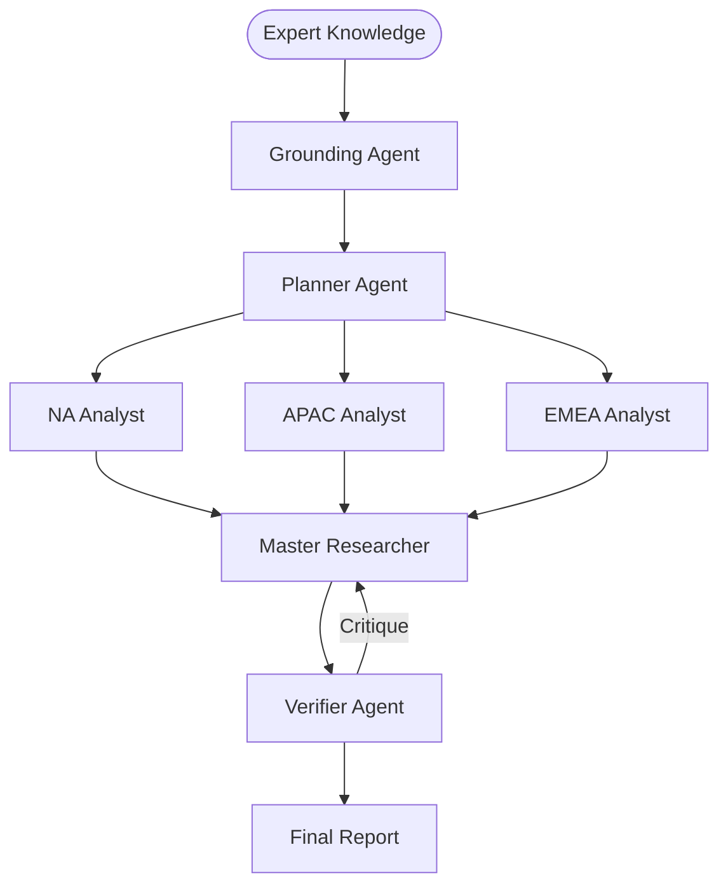

# 🔬 DeepResearch-MAS: GTM Strategy for a SaaS Startup

## 📉 System Evaluation & Metrics
* ✅ PLANNER_EVAL: Goal decomposition successful.
* ❌ VERIFIER_EVAL: Retry 1 triggered.
* ✅ VERIFIER_EVAL: Passed on attempt 2.

## 🏗️ P-E-V Orchestration Logic
| Step | Handoff Reason | Next Agent |
| :--- | :--- | :--- |
| 1 | Planner defined regional decomposition. | 🌍 Regional Agents |
| 2 | Regional analysts completed parallel tasks. | ⚖️ Verifier |

## 🗺️ Agent Orchestration Trace

## 📝 Final Deep Research Output
To address the issues identified while maintaining the notion of a "unified" strategy, we can refine the document to ensure it represents an integrated yet adaptable approach that balances overall strategic unity with regional customization. Here's a revised version:

---

### Unified Go-To-Market (GTM) Strategy for SaaS Startups Across North America, APAC, and EMEA

**Overview:**
The global SaaS market presents distinct challenges and opportunities in North America, APAC, and EMEA. While a truly unified strategy integrates core principles across regions, it must also allow for tailored approaches that address specific regulatory, competitive, and customer landscapes. Our GTM strategy adopts a holistic framework that aligns regional tactics under a unified vision of market segmentation, value proposition, and compliance adherence.

---

### 1. Cohesive Market Segmentation and Target Audience

While specific audience traits differ, a unified approach identifies common target sectors such as finance, healthcare, and technology, which are universally undergoing digital transformation. We deploy region-specific nuances within this framework:

#### North America:
- Tailor to digital transformation leaders (CMOs, CTOs) in sectors like finance and healthcare seeking advanced compliance-driven solutions.

#### APAC:
- Focus on emerging industries such as fintech and logistics, catering to departmental innovators (CIOs) driving automation.

#### EMEA:
- Address needs of mid-to-large enterprises in finance, emphasizing stringent compliance and data-driven strategies.

---

### 2. Articulating a Unified yet Agile Value Proposition

Our value proposition speaks to universal SaaS challenges like data management and compliance while allowing regional variation:

- Highlight features like zero-copy architecture and agentic AI enablement, with localized emphasis on compliance and consent management for each region's regulatory landscape.

---

### 3. Integrated Multi-Channel Marketing and Strategic Partnerships

The unified strategy emphasizes channel synergy while optimizing regional content delivery and partnership engagement:

#### North America:
- Leverage thought leadership across diverse platforms while executing account-based marketing (ABM) for specific high-value targets.

#### APAC:
- Implement localized content strategies, utilizing local language nuances and regional platforms for maximum impact.

#### EMEA:
- Build credibility through partnerships with regulatory authorities and emphasize compliance in marketing content focused on ethical AI.

---

### 4. Harmonized Sales and Customer Engagement

A consistent focus on sales enablement and customer success integrates global best practices with local adaptations:

- Equip sales teams with deep knowledge of regional compliance, supported by globally consistent training resources.
- Use frictions-less onboarding, such as freemium models, to encourage adoption across diverse markets.

---

### 5. Comprehensive Approach to Regulatory Compliance and Data Privacy

Adopt a unified compliance architecture robust enough for global standards, with specific adaptations:

- Ensure project alignment with frameworks like GDPR and PIPL by regularly engaging local legal expertise for region-specific adjustments.

---

### 6. Metrics, Feedback, and Continuous Improvement

Continuous improvement relies on unified measurement systems adaptable to regional variances:

- Track global KPIs while addressing regional differences, ensuring readiness for compliance audits.
- Perform iterative strategic reviews with a global lens to ensure relevance in dynamic regulatory environments.

---

### Conclusion

Our unified GTM strategy for SaaS startups integrates regional adaptations within a cohesive framework that aligns with global market dynamics, regulatory compliance, and customer-centric innovation. This approach ensures sustainable growth and leadership in the evolving digital transformation landscape while respecting regional diversity.

## 🕵️ Unresolved Doubts & Expert Handoffs
To enhance the proposed Unified Go-To-Market (GTM) strategy for SaaS startups, you may consider including the following three missing enterprise data points:

1. **Regional Market Size and Growth Projections:**
   - Including specific data on the size of the SaaS market and its projected growth in North America, APAC, and EMEA will provide a clearer picture of potential opportunities and resource allocation. This data can help prioritize efforts and tailor strategies based on market potential in each region.

2. **Competitive Landscape Analysis:**
   - Detailed insights into the competitive dynamics within each region are crucial. This should include the identification of key competitors, their market share, strengths and weaknesses, and strategic positioning. Understanding the competition will inform the differentiation strategies and allow the GTM plan to better address gaps in the market.

3. **Customer Persona Development and Pain Points:**
   - A more in-depth analysis of customer personas across regions, including their specific pain points, buying behaviors, and decision-making processes. This granular understanding will help to tailor marketing messages, sales tactics, and support services to meet the unique needs of different customer segments, enhancing engagement and conversion rates.