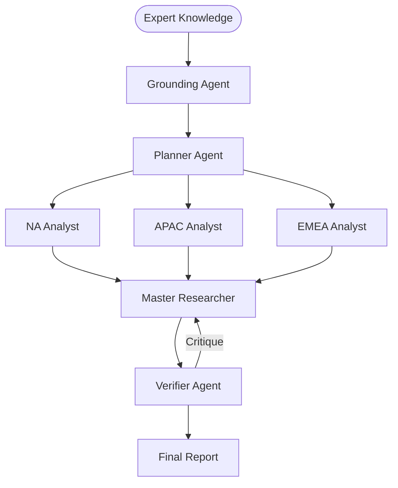

# 🔬 DeepResearch-MAS: Crypto Regulation Policy Analysis

## 📉 System Evaluation & Metrics
* ✅ PLANNER_EVAL: Goal decomposition successful.
* ✅ VERIFIER_EVAL: Passed on attempt 1.

## 🏗️ P-E-V Orchestration Logic
| Step | Handoff Reason | Next Agent |
| :--- | :--- | :--- |
| 1 | Planner defined regional decomposition. | 🌍 Regional Agents |
| 2 | Regional analysts completed parallel tasks. | ⚖️ Verifier |

## 🗺️ Agent Orchestration Trace

## 📝 Final Deep Research Output
## Unified Report: Scenario Planning for Global Crypto Regulation Policy

### Introduction

As the cryptocurrency landscape evolves globally, regulation is at the forefront of discussions across different regions. This report merges insights from three critical regions: North America (NA), Asia-Pacific (APAC), and Europe, Middle East, and Africa (EMEA). Each region faces unique challenges and opportunities as they navigate the complexities of regulating digital assets. This comprehensive analysis examines key drivers of change, potential regulatory scenarios, and implications for stakeholders across these regions.

### Key Drivers of Change

1. **Legislative Momentum and Fragmentation**: Across these regions, there is an increasing interest from legislative bodies to establish clear regulatory frameworks. However, the degree of harmonization varies, with some areas experiencing fragmented approaches.
   
2. **Technological Advancements**: As blockchain technology, Decentralized Finance (DeFi), and other innovations evolve, they influence regulatory strategies. Agile regulations that balance innovation with investor protection are necessary.

3. **Public Sentiment and Security Concerns**: Public concerns surrounding investor protection, environmental impacts, and cybersecurity are significant drivers of regulatory actions, impacting the pace and nature of policy formulation.

4. **Global Coordination Efforts and Divergence**: International coordination, as seen with entities like the Financial Action Task Force (FATF) and the EU’s MiCA framework, can lead to either harmonized or fragmented regulatory landscapes. How regions cooperate or diverge on these issues shapes the market.

### Potential Scenarios

#### North America

1. **Light-Touch Regulation**: Permissive, self-regulating environment fostering innovation but with potential risks of fraud.
   
2. **Comprehensive Regulatory Frameworks**: Structured regulations similar to traditional financial systems, potentially stifling smaller startups but increasing investor protection.

3. **Prohibition and Heavy Penalties**: Outright bans on cryptocurrencies leading to underground markets and loss of consumer confidence.

4. **Global Coordination and Standardization**: Harmonized global regulations, reducing compliance burdens and fostering innovation.

#### Asia-Pacific (APAC)

1. **Harmonized Regulatory Frameworks**: Cooperation among APAC nations leading to clear guidelines, promoting market growth but posing challenges for smaller firms.

2. **Fragmented Regulations**: Divergent approaches causing regulatory arbitrage and increased complexity in compliance.

3. **Proactive Regulation**: Focused on consumer protection and cybersecurity, fostering public trust but challenging innovation cycles.

4. **Heavy-Handed Regulation**: Strict regulations leading to a decline in crypto activity and risk of underground markets.

#### Europe, Middle East, and Africa (EMEA)

1. **Harmonized Regulatory Framework**: Unified regulations promoting growth and innovation but requiring significant time and adaptation.
   
2. **Fragmented Regulation Landscape**: Diverse approaches increasing compliance risks and potentially stifling innovation.

3. **Over-Regulation**: Heavy restrictions causing talent and innovation to move abroad, potentially fostering black markets.

4. **Proactive Regulatory Engagement**: Adaptive frameworks, responsive to technology and market conditions, encouraging collaboration and upskilling.

### Assessing Implications

1. **Business Strategy**: Businesses must adapt compliance and innovation strategies based on regional scenarios, balancing proactive engagement with agility.

2. **Market Landscape**: Regulatory scenarios guide mergers, acquisitions, and investment strategies, influencing market dynamics and competitive positioning.

3. **Risk Management**: Companies should employ risk management practices catering to changing regulatory environments, including preparing compliance frameworks and managing consumer trust.

4. **Investment Considerations**: Investors should align portfolios with proactive entities in compliance and regulatory engagement, especially where stringent frameworks are anticipated.

### Research and Monitoring Recommendations

1. **Stakeholder Analysis**: Engage with regulatory bodies, industry leaders, and other stakeholders to influence balanced policy development.

2. **Regulatory Impact Assessments**: Continuously assess how scenarios affect market stability, consumer trust, and growth trajectories.

3. **Comparative Analysis**: Examine successful regulatory frameworks from jurisdictions like the US and Singapore as best practice guides.

4. **Public Awareness Campaigns**: Develop educational initiatives to better inform the public about cryptocurrency risks and opportunities under new regulations.

5. **Scenario Drills and Planning**: Regular scenario planning with industry stakeholders to anticipate and mitigate risks associated with regulatory changes.

### Conclusion

Globally, the regulation of cryptocurrencies is poised for substantial changes, with each region facing distinct scenarios. Stakeholders must remain adaptable and informed, preparing for diverse regulatory environments that will significantly impact strategic and operational decisions. Continuous monitoring of legislative developments and international coordination efforts will be essential in navigating the increasingly complex and fast-evolving landscape of crypto regulation.

## 🕵️ Unresolved Doubts & Expert Handoffs
To enhance the Unified Report on Scenario Planning for Global Crypto Regulation Policy, the following three enterprise data points could be beneficial but are currently missing:

1. **Market Size and Growth Metrics**: Comprehensive data on the current market size, adoption rates, and growth projections for cryptocurrencies within each region (NA, APAC, EMEA) would provide context for the potential impact of regulatory changes. This could include metrics on user engagement, transaction volumes, and the number of active crypto businesses, which could help stakeholders understand the economic implications of varying regulatory approaches.

2. **Compliance Costs and Resources**: Data outlining the average costs and resources required for compliance with existing and potential future regulations across different regions would be critical for businesses and investors. This includes information on legal fees, technology investments, and operational changes needed to meet compliance standards. Understanding the financial burden can inform strategic decisions and highlight the feasibility of maintaining operations under different regulatory scenarios.

3. **Stakeholder Sentiment Analysis**: Gathering qualitative and quantitative data on stakeholder sentiments (including businesses, investors, consumers, and regulatory bodies) towards current and prospective regulations in each region could provide insights into potential challenges or support for regulatory initiatives. Sentiment analysis could reveal the willingness of different groups to adapt to regulations and the expected impact on market behavior, enabling a more nuanced understanding of the regulatory landscape.

Including these data points would not only enrich the report’s analysis but also provide actionable insights for stakeholders navigating the complexities of global cryptocurrency regulation.