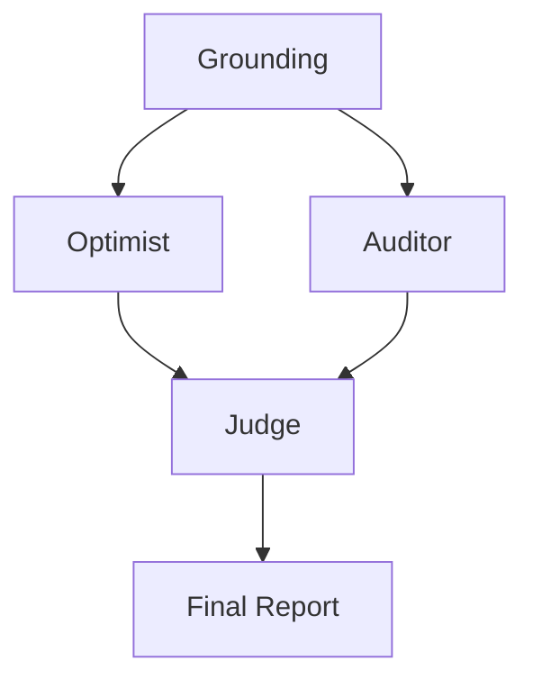

# 🔬 DeepResearch-MAS: CDP

> **Orchestration Pattern:** ADVERSARIAL_DEBATE

## 📉 System Evaluation & Metrics
* ✅ PATTERN_TRIGGER: ADVERSARIAL_DEBATE selected.

## 🏗️ Dynamic Orchestration Logic
| Step | Handoff Reason | Next Agent |
| :--- | :--- | :--- |
| 0 | Grounding Scan | System initialized with expert world-view docs. |
| 1 | Adversarial Turn | Optimist and Auditor generated conflicting viewpoints. |
| 2 | Synthesis | Judge mediated debate into final artifact. |

## 🗺️ Agent Orchestration Trace

## 🏆 Multi-Agent vs. Single-Agent Benchmarks
| Feature | Traditional LLM | This MAS System |
| :--- | :--- | :--- |
| **Pattern** | Static / Linear | Dynamic ADVERSARIAL_DEBATE |
| **Bias** | Highly Optimistic | Adversarial Counter-weight |

## 📝 Final Deep Research Output
### Risk-Adjusted Report on the Long-Term Viability of Composable Customer Data Platforms (CDPs)

#### Executive Summary
The evolving landscape of Customer Data Platforms (CDPs), particularly composable and warehouse-native solutions, presents both significant opportunities and notable risks. This report synthesizes the debate into a risk-adjusted analysis, evaluating the optimistic projections against potential pitfalls to provide a comprehensive outlook on the sector’s long-term viability.

#### Opportunities and Optimistic Projections

1. **Zero-Copy Data Revolution:**
   - **Opportunity:** Expected to eliminate ETL redundancies by 2026, leading to enhanced data integrity, quicker implementation, and cost savings. Enhanced security and real-time visibility are additional benefits.
   - **Strategy:** Embrace zero-copy frameworks with robust encryption and access permissions to address security concerns.

2. **Regulatory Alignment and Privacy-First Design:**
   - **Opportunity:** Composable CDPs with built-in consent management and privacy features can become indispensable for navigating regulations such as GDPR and India’s DPDP.
   - **Strategy:** Form agile compliance teams and leverage AI to manage compliance complexities, ensuring quick adaptation to new laws.

3. **AI Augmentation and Agentic Orchestration:**
   - **Opportunity:** Integration of generative AI can unlock new personalization levels, driving competitive advantage through enhanced customer engagement.
   - **Strategy:** Develop transparent AI protocols to mitigate bias and ensure coordination between human oversight and automated processes.

4. **Market Dynamics and Competitive Landscape:**
   - **Opportunity:** The rise of composable architectures offers unparalleled flexibility, appealing to SMEs and large enterprises, fostering a dynamic market.
   - **Strategy:** Encourage data portability and maintain diverse strategies to reduce the risks of vendor lock-in and market consolidation.

#### Risks and Potential Challenges

1. **Privacy and Regulation Compliance Risks:**
   - **Threat:** Over-reliance on probabilistic identity matching can conflict with stringent privacy laws, risking audits and fines.
   - **Mitigation:** Prioritize consent management as a core feature rather than an afterthought to ensure rigorous compliance.

2. **Technology and Operational Risks:**
   - **Threat:** Security bottlenecks in zero-copy frameworks and the complexity of composable architectures can pose significant challenges, particularly for organizations lacking technical expertise.
   - **Mitigation:** Enhance security measures and invest in upskilling teams to manage composable architectures effectively.

3. **AI and Automation Risks:**
   - **Threat:** AI models require high data quality; poor data can lead to misidentifications and biased outcomes.
   - **Mitigation:** Ensure high-quality data inputs and continuously monitor AI outputs for bias and accuracy.

4. **Market and Strategic Risks:**
   - **Threat:** Vendor lock-in and market consolidation can limit flexibility and increase costs.
   - **Mitigation:** Develop interoperable solutions and remain vigilant of market dynamics to avoid obsolescence.

5. **Scenario Planning Gaps:**
   - **Threat:** Lack of planning for unforeseen regulatory shifts and macroeconomic volatility.
   - **Mitigation:** Incorporate comprehensive scenario planning for regulatory changes and economic fluctuations into strategic discussions.

#### Conclusion

**Strategic Recommendations:**

1. **Invest in Robust Infrastructure:** Future-proof systems by adopting zero-copy and warehouse-native architectures with strong security frameworks.
2. **Prioritize AI Integration and Compliance:** Build platforms with embedded AI capabilities and consent management to stay regulatory-compliant and innovative.
3. **Foster Innovation and Flexibility:** Encourage continuous platform evolution to maintain market leadership while preparing for regulatory and economic shifts.

### Final Assessment
Composable CDPs hold promising potential for redefining data management and customer engagement. However, their success hinges on addressing regulatory, technological, and market risks through proactive strategies. By balancing innovation with rigorous risk management, organizations can capitalize on the opportunities presented by these emerging platforms.

## 🕵️ Unresolved Doubts & Expert Handoffs
To enhance the completeness and robustness of the Risk-Adjusted Report on the Long-Term Viability of Composable Customer Data Platforms (CDPs), consider including the following three enterprise data points:

1. **Benchmark Data on Performance Metrics:**
   - **Description:** Incorporate quantitative performance metrics from existing composable CDPs, such as customer acquisition cost (CAC), customer lifetime value (CLV), user engagement metrics, and return on investment (ROI). This data will help establish a baseline against which the projected benefits of composable CDPs can be evaluated.
   - **Relevance:** This benchmark data will enable organizations to assess whether the optimistic projections regarding efficiency and cost savings can be realized based on real-world performance, thereby aiding in risk assessment.

2. **Market Adoption Rates and Trends:**
   - **Description:** Present data on the current adoption rates of composable CDPs among various industry sectors and the projected growth rate over the next 3 to 5 years. Include insights into market maturity and user feedback to understand market dynamics better.
   - **Relevance:** Understanding how quickly businesses are transitioning to composable CDPs will provide insights into potential market risks and opportunities. It will also illustrate the competitive landscape, informing strategic recommendations.

3. **Regulatory Compliance Landscape Data:**
   - **Description:** Provide an overview of the current status of relevant privacy regulations by region, including what compliance metrics companies are measured against, and trends in enforcement actions that have taken place recently. Detail the evolving language in legislation and any upcoming regulatory changes on the horizon.
   - **Relevance:** By incorporating this data, organizations can better gauge the complexities of evolving regulatory landscapes and the implications for implementing composable CDPs. This insight will inform risk mitigation strategies and make clear the urgency of compliance initiatives. 

Including these data points will provide a more comprehensive understanding of both the opportunities and challenges presented by composable CDPs, enhancing the value of the report for decision-makers.