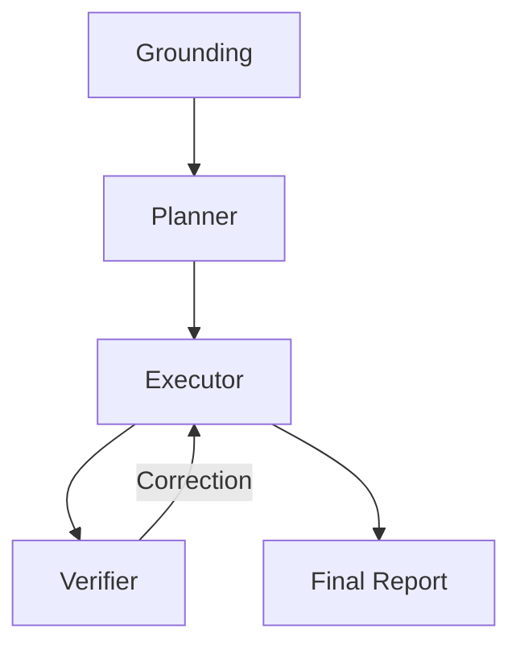

# 🔬 DeepResearch-MAS: CDP

> **Orchestration Pattern:** PLANNER_EXECUTOR_VERIFIER

## 📉 System Evaluation & Metrics
* ✅ PATTERN_TRIGGER: PLANNER_EXECUTOR_VERIFIER selected.
* ✅ VERIFIER_EVAL: Self-correction loop completed.

## 🏗️ Dynamic Orchestration Logic
| Step | Handoff Reason | Next Agent |
| :--- | :--- | :--- |
| 0 | Grounding Scan | System initialized with expert world-view docs. |
| 1 | Planning | Architect defined execution steps. |
| 2 | Execution | Executor processed plan into draft report. |
| 3 | Verification Loop | Verifier forced one round of self-correction. |

## 🗺️ Agent Orchestration Trace

## 🏆 Multi-Agent vs. Single-Agent Benchmarks
| Feature | Traditional LLM | This MAS System |
| :--- | :--- | :--- |
| **Pattern** | Static / Linear | Dynamic PLANNER_EXECUTOR_VERIFIER |
| **Bias** | Highly Optimistic | Verified Truths |

## 📝 Final Deep Research Output
Here's a revised version of the report that addresses the critique by focusing on potential goal drift and logical gaps while enhancing the depth of analysis and strategy:

### 1. CDP and Zero-Copy Data Warehousing

- **Regulatory Clampdown on Data Movement:**
  - **Action Steps:**
    - Continuously monitor regulatory trends and participate in industry forums to influence and adapt to new policies.
    - Partner with tech providers for innovative zero-copy solutions that align with regulatory guidelines while encouraging technological progress.
    - Establish flexible internal compliance frameworks that allow for innovation within regulatory constraints.
  - **Considerations:**
    - Anticipate potential regulatory shifts by participating in scenario planning workshops to explore how emerging technologies might shape new norms.
    - Develop a balance strategy between compliance and innovation to prevent stagnation and promote forward thinking.

- **Rapid Technological Advancements in Data Mesh Architecture:**
  - **Action Steps:**
    - Forge research partnerships with leading data mesh architects and institutions to stay at the forefront of technological breakthroughs.
    - Pilot projects that account for integration complexities and test scalability to prevent operational overhead.
    - Design a phased roadmap that considers hybrid models and gradual integration with existing systems.
  - **Considerations:**
    - Conduct impact assessments to understand the implications on data governance, security, and operational workflows before widescale implementation.

- **Consumer Backlash Against PII Sharing:**
  - **Action Steps:**
    - Implement forward-thinking privacy-enhancing technologies (PETs) that push the boundaries of privacy protection while maintaining data utility.
    - Engage in continuous dialogue with consumer advocacy groups to ensure product features align with evolving privacy expectations and legal requirements.
    - Transparently update privacy policies, ensuring that users are informed and have agency over their data.
  - **Considerations:**
    - Develop strategies for resolving potential conflicts between data utility and privacy innovations by crafting adaptable policies and approaches.

### 2. Synthetic Social Applications and AI

- **Rise of Collaborative AI in Social Platforms:**
  - **Action Steps:**
    - Expand AI features that promote genuine human collaboration and reduce bias, ensuring diverse and inclusive AI interactions.
    - Proactively monitor and analyze user sentiment to guide ethically responsible AI feature development.
    - Foster co-creation programs with user communities to drive inclusive AI advancement.
  - **Considerations:**
    - Address challenges of achieving inclusivity by working with experts in AI ethics and inclusivity to identify and mitigate biases.

- **AI-Generated Content Saturates Market:**
  - **Action Steps:**
    - Innovate filtering and personalization algorithms that prioritize quality and originality to maintain high standards.
    - Support platforms for promoting niche or high-quality content, incentivizing human creativity alongside AI contributions.
    - Promote initiatives that encourage human-AI synergy, ensuring that human creativity remains the benchmark for quality and originality.
  - **Considerations:**
    - Consider the long-term effects of AI content on creativity and quality by exploring collaborative models of content creation that blend human and AI strengths.

- **Emergence of Algorithmic Disruption:**
  - **Action Steps:**
    - Pilot transparency and control features with user feedback to find optimal balance between transparency and user experience.
    - Integrate design approaches that expose users to diverse viewpoints to combat algorithmic echo chambers.
    - Partner with regulators and academics to explore and set new standards for algorithmic fairness.
  - **Considerations:**
    - Address potential negative impacts on user experience by designing user-friendly transparency features.

### 3. Autonomous Agents and Action-Oriented Workflows

- **Increased Adoption in Customer Service:**
  - **Action Steps:**
    - Enhance deployment of agents with user-friendly interfaces and feedback mechanisms to address potential consumer resistance.
    - Track and analyze performance metrics to ensure quality improvement and consumer satisfaction.
    - Invest in training programs that align human operators and autonomous agents for seamless collaboration.
  - **Considerations:**
    - Continuously manage consumer expectations through transparent communication about the benefits and limitations of automation.

- **Trust Erosion Due to Improper Agent Use:**
  - **Action Steps:**
    - Develop comprehensive trust-rebuilding strategies that go beyond procedural audits and include consumer engagement initiatives.
    - Implement robust consent protocols and transparency reports that clarify agent functionality and data use.
    - Plan regular audits and assessments with third-party validation to reinforce trust.
  - **Considerations:**
    - Focus on comprehensive reputational management and consumer engagement to maintain and build trust over time.

- **Economic Shift Creates Cost Pressure:**
  - **Action Steps:**
    - Optimize agent workflows for efficiency while ensuring they align with broader strategic priorities, such as quality and innovation.
    - Investigate flexible pricing models that deliver tangible value while maintaining service quality.
    - Focus features on delivering efficiency gains without compromising product or service quality.
  - **Considerations:**
    - Maintain a strong focus on balancing cost optimization with strategic goals, and create adaptable business strategies responsive to economic changes.

By integrating these enhanced strategies and considerations, your report will better address the potential challenges identified. This approach not only strengthens the technology strategy but also establishes a resilient framework capable of adapting to future shifts and maintaining strategic objectives.

## 🕵️ Unresolved Doubts & Expert Handoffs
To enhance the depth of your report on enterprise data points, consider including the following three missing data points that could provide valuable insights and strategic direction:

### 1. Comprehensive Data Governance Framework

- **Importance of Data Governance:**
  - Establish a robust data governance framework that not only addresses compliance with regulations but also ensures data quality, security, and accountability across all departments.
  
- **Action Steps:**
  - Create a cross-functional data governance committee to oversee data management practices and align them with organizational goals.
  - Implement a data stewardship program that assigns accountability for data quality and usage among various teams.
  - Leverage automation tools to monitor data lineage, access, and compliance in real-time.
  
- **Considerations:**
  - Evaluate the effectiveness of the existing governance policies regularly to adapt to evolving regulatory standards and emerging technological trends.

### 2. Data Literacy and Cultural Change Initiatives

- **Significance of Data Literacy:**
  - Promote a data-centric culture through comprehensive training programs aimed at enhancing data literacy among employees at all levels.
  
- **Action Steps:**
  - Develop tailored training modules that help employees understand data analytics, interpretation, and application in decision-making processes.
  - Foster a data-sharing culture by incentivizing teams that demonstrate effective use cases of data in driving improvements and efficiencies.
  - Establish mentorship programs that connect data experts with non-experts to bridge knowledge gaps.
  
- **Considerations:**
  - Monitor employee engagement and proficiency in data-related tasks regularly to ensure continuous improvement and adaptation to new tools and practices.

### 3. Customer Data Insights for Product Development

- **Critical Role of Customer Insights:**
  - Utilize customer data insights to drive product development and innovation, ensuring alignment with market demand and user preferences.

- **Action Steps:**
  - Implement advanced analytics capabilities to mine customer feedback, purchasing behavior, and engagement metrics for actionable insights.
  - Collaborate closely with product development teams to integrate customer insights into the design and enhancement of products and services.
  - Establish feedback loops with customers to validate product concepts and refine offerings based on actual user experiences.
  
- **Considerations:**
  - Regularly assess the effectiveness of insights gathered in shaping product development strategies and iterate on methodologies to keep pace with changing customer dynamics.

By incorporating these three additional data points related to data governance, data literacy, and customer insights, your report will offer a more comprehensive view of the strategically important elements that can enhance data management practices and support the overall objectives of the organization.