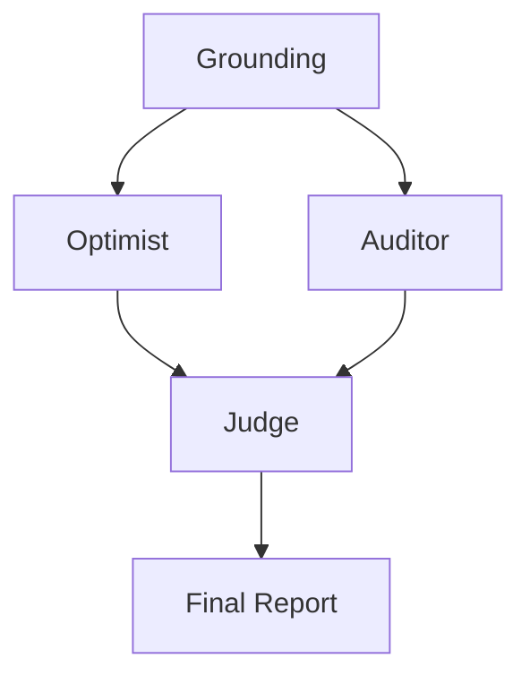

# 🔬 DeepResearch-MAS: CDP

> **Orchestration Pattern:** ADVERSARIAL_DEBATE

## 📉 System Evaluation & Metrics
* ✅ PATTERN_TRIGGER: ADVERSARIAL_DEBATE selected.

## 🏗️ Dynamic Orchestration Logic
| Step | Handoff Reason | Next Agent |
| :--- | :--- | :--- |
| 0 | Grounding Scan | System initialized with expert world-view docs. |
| 1 | Adversarial Turn | Optimist and Auditor generated conflicting viewpoints. |
| 2 | Synthesis | Judge mediated debate into final artifact. |

## 🗺️ Agent Orchestration Trace

## 🏆 Multi-Agent vs. Single-Agent Benchmarks
| Feature | Traditional LLM | This MAS System |
| :--- | :--- | :--- |
| **Pattern** | Static / Linear | Dynamic ADVERSARIAL_DEBATE |
| **Bias** | Highly Optimistic | Adversarial Counter-weight |

## 📝 Final Deep Research Output
### Risk-Adjusted Report: Long-term Viability of Customer Data Platforms (CDPs)

#### Overview

**Customer Data Platforms (CDPs)** are evolving in response to changing technological, regulatory, and market landscapes. Proponents argue their sustained relevance hinges on innovation, especially in zero-copy architectures and AI-enabled orchestration, while critics point out significant risks in identity resolution, reliance on outdated technologies, and compliance challenges. This report synthesizes both perspectives to provide a risk-adjusted analysis of the CDP market, projecting trends and strategic recommendations up to 2026 and beyond.

### Proponents' Case for CDPs

#### Key Innovations

1. **Zero-Copy and Warehouse-Native Architectures**
   - **Security and Privacy Compliance:** These architectures align well with modern privacy laws (e.g., GDPR, CCPA) by minimizing data movement, therefore reducing breach risks and bolstering compliance.
   - **Scalability and Cost Efficiency:** They eliminate redundant storage and reduce operational costs, providing organizations an efficient path to scale using existing cloud infrastructures like Snowflake and BigQuery.
   - **Real-Time Decision-Making:** Facilitates instantaneous insights activation, essential for delivering personalized customer experiences in a demand-driven market.

2. **Agentic Orchestration**
   - **AI-Powered Operations:** AI and predictive models empower CDPs to autonomously manage audience segmentation and interaction personalization, meeting market demands for efficiency and enhanced customer journeys.
   - **Operational Flexibility:** Allows rapid adaptation to market changes by automating routine tasks, thus enabling businesses to focus on strategic initiatives.

#### Strategic Trends

1. **Regulatory & Privacy Adaptations:** Integral embedding of consent management into CDPs will be a non-negotiable feature driven by legal demands worldwide.
2. **Emergence of Data Clean Rooms:** These will become strategic necessities for ethical data handling and AI model training.
3. **Scenario Planning:** Opportunities and risks emerge under various scenarios such as AI dominance in orchestration, hybrid human-AI collaboration, and impacts of stringent data sovereignty laws.

### Critics' Challenges to CDPs

#### Critical Risks

1. **Probabilistic Matching Risks**
   - Relies on less accurate methods for identity resolution, complicating compliance with stricter privacy regulations and exposing firms to potential legal and reputational damages.

2. **Reliance on Third-Party Cookies**
   - Continued use of these outdated methods risks obsolescence amid evolving browser policies and privacy laws.

3. **Batch-Processed Consent**
   - Non-real-time consent management exposes platforms to legal liabilities and undermines user trust.

4. **Data Movement and Security**
   - Unnecessary data movement introduces security vulnerabilities, heightening the risk of costly data breaches.

### Scenario Planning Recommendations

#### For CDPs

1. **Adopt Zero-Copy Architectures:** Invest in federated systems to minimize data movement, ensuring security and cost efficiency.
2. **Prioritize Regulation Compliance:** Embed adaptable compliance modules to meet global regulatory requirements dynamically.
3. **Embrace Real-Time, AI-Driven Systems:** Upgrade architectures to support low-latency, high-volume AI operations, ensuring relevance amid advanced competitors.

#### For AgTech

1. **Hardware Investment:** Develop durable designs capable of withstanding environmental and chemical exposures to prevent high failure rates.
2. **Ensure Repairability:** Focus on modular, farmer-maintainable equipment to increase adoption and reduce lifecycle costs.

### Conclusion

The future of CDPs likely resides in embracing architectural innovations like zero-copy models and AI-powered orchestration, which address privacy regulations and improve operational efficiencies. However, critical risks like reliance on probabilistic identity resolution and outdated tracking methods could impair market standing. Scenario planning, adaptive compliance strategies, and a focus on real-time AI functionalities can fortify CDPs against regulatory pressures and technological upheaval, ensuring their viability and competitive edge in the evolving landscape.

## 🕵️ Unresolved Doubts & Expert Handoffs
To enhance the Risk-Adjusted Report on the long-term viability of Customer Data Platforms (CDPs), consider the following three missing enterprise data points:

1. **Market Adoption Metrics:**
   - **Current Market Penetration Rate of CDPs:** Provide data on how widely CDPs are adopted across various industries. This could include percentage growth in customer base, number of active CDPs in use, and comparisons between CDP adoption in different sectors (e.g., retail, finance, healthcare). These metrics help gauge overall market health and the potential for future growth or contraction of CDPs.

2. **Compliance Breach Statistics:**
   - **Data on Historical Compliance Violations Related to CDPs:** Present statistics on the number of compliance breaches associated with CDP usage, detailing the type of breaches (e.g., data exposure, improper consent management). This data would help assess the risk exposure concerning the legal and reputational impacts of using current CDP architectures, especially related to probabilistic identity resolution and third-party cookie reliance.

3. **Investment Trends in AI and Zero-Copy Technologies:**
   - **Funding and Innovation Metrics for CDP Technologies:** Include data on venture capital investments, mergers, and acquisitions related to AI and zero-copy architectures in the CDP market. This would highlight industry confidence and financial backing for innovations addressing critical challenges. Information on the trend of R&D expenditure within leading CDPs, especially regarding efforts to pivot toward safer, more efficient technologies, can provide insight into the strategic priorities and future direction of the market.

Incorporating these data points will strengthen the report by providing a more comprehensive view of the CDP landscape, highlighting the opportunities and challenges that may impact their long-term viability.