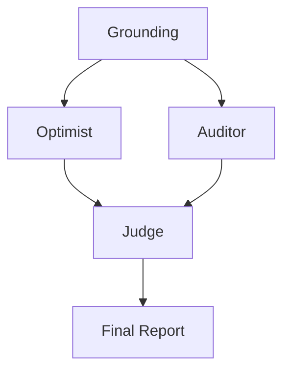

# 🔬 DeepResearch-MAS: CDP

> **Orchestration Pattern:** ADVERSARIAL_DEBATE

## 📉 System Evaluation & Metrics
* ✅ PATTERN_TRIGGER: ADVERSARIAL_DEBATE selected.

## 🏗️ Dynamic Orchestration Logic
| Step | Handoff Reason | Next Agent |
| :--- | :--- | :--- |
| 0 | Grounding Scan | System initialized with expert world-view docs. |
| 1 | Adversarial Turn | Optimist and Auditor generated conflicting viewpoints. |
| 2 | Synthesis | Judge mediated debate into final artifact. |

## 🗺️ Agent Orchestration Trace

## 🏆 Multi-Agent vs. Single-Agent Benchmarks
| Feature | Traditional LLM | This MAS System |
| :--- | :--- | :--- |
| **Pattern** | Static / Linear | Dynamic ADVERSARIAL_DEBATE |
| **Bias** | Highly Optimistic | Adversarial Counter-weight |

## 📝 Final Deep Research Output
### Risk-Adjusted Report: Evaluating the Long-term Viability of Customer Data Platforms (CDPs) with Zero-Copy Data Handling

#### Executive Summary

The debate on the long-term viability of Customer Data Platforms (CDPs) with zero-copy data handling highlights both promising opportunities and potential risks. As enterprises navigate the evolving landscape of data privacy, efficiency, and technology integration, zero-copy CDPs are positioned as a transformative solution for modern digital infrastructure. However, the adoption and implementation of these platforms carry inherent challenges that must be managed strategically.

#### Opportunities and Strengths

1. **Regulatory Compliance**:
   - **Opportunity**: Zero-copy architectures offer streamlined compliance with stringent data privacy regulations such as GDPR and CCPA by reducing data movement and duplication, thereby minimizing breach risks and enhancing trust.
   - **Strategic Advantage**: Multinational corporations can navigate global compliance landscapes seamlessly, positioning themselves as leaders in privacy-centric data management.

2. **Operational Efficiency**:
   - **Opportunity**: By leveraging warehouse-native architectures, organizations can bypass data silos, enabling real-time data processing and activation. This reduces storage costs and enhances decision-making velocity.
   - **Strategic Advantage**: Companies can achieve a lower Total Cost of Ownership (TCO) and faster time-to-market, offering a competitive edge in digital transformation initiatives.

3. **AI-Driven Personalization**:
   - **Opportunity**: Integrating AI agents for real-time data orchestration allows for dynamic and personalized customer experiences, a key differentiator in customer engagement strategies.
   - **Strategic Advantage**: Enhanced customer interactions and personalized marketing drive customer satisfaction and loyalty.

4. **Future-Proofing with Composable Architectures**:
   - **Opportunity**: Modular integration capabilities allow businesses to build flexible, scalable solutions that align with future technological advancements.
   - **Strategic Advantage**: Firms can adapt swiftly to changing business needs and technological innovations, enhancing resilience.

#### Risks and Challenges

1. **Technical and Implementation Challenges**:
   - **Challenge**: Implementing zero-copy architectures requires real-time federated data access, posing technical difficulties, particularly around latency and query complexity.
   - **Risk Mitigation**: Investing in robust infrastructure and skilled technical teams can alleviate integration issues and support successful deployments.

2. **Privacy and Security Complexities**:
   - **Challenge**: Managing data privacy and security across various jurisdictions with disparate regulations is intricate and resource-intensive.
   - **Risk Mitigation**: Developing comprehensive data governance frameworks and maintaining transparent consent management will safeguard user trust and regulatory compliance.

3. **AI and Ethical Concerns**:
   - **Challenge**: Over-reliance on AI for decision-making can lead to ethical dilemmas and potential biases without adequate oversight.
   - **Risk Mitigation**: Implementing AI governance policies and ensuring human oversight in AI-driven processes will mitigate ethical risks and align with regulatory standards.

4. **Scalability Limitations**:
   - **Challenge**: Ensuring that real-time execution capabilities scale effectively can be constrained by system efficiencies and data volume growth.
   - **Risk Mitigation**: Continuous investment in system optimization and innovation will support scalability and maintain competitive advantage.

5. **Vendor Lock-in and Integration Costs**:
   - **Challenge**: Composable architectures may result in increased integration complexity and risk vendor lock-in without appropriate strategies.
   - **Risk Mitigation**: Engaging in strong vendor partnerships and ensuring interoperability with existing systems will minimize lock-in risks and integration costs.

#### Conclusion

The adoption of zero-copy CDPs presents strategic benefits aligned with current corporate objectives around efficiency, regulatory compliance, and customer engagement. However, realizing these benefits requires addressing significant challenges, particularly around technical implementation and regulatory complexities. By proactively managing these risks and focusing on strategic innovation and partnership, organizations are better positioned to harness the full potential of CDPs and achieve sustainable growth in a digital-first economy.

## 🕵️ Unresolved Doubts & Expert Handoffs
To effectively assess the long-term viability of Customer Data Platforms (CDPs) with zero-copy data handling, the following three enterprise data points are crucial and currently missing from the provided report:

1. **Return on Investment (ROI) Metrics**:
   - **Importance**: A clear calculation of ROI associated with the implementation of zero-copy CDPs is vital. This should include comparisons of cost savings from operational efficiencies, reduced storage expenses, and improved revenue from enhanced customer engagement through AI-driven personalization.
   - **Usefulness**: Providing quantitative data on ROI will enable organizations to make informed decisions regarding the financial implications of adopting zero-copy CDPs, fostering buy-in from stakeholders.

2. **User Adoption Rates and Customer Feedback**:
   - **Importance**: Gathering data on how end-users (both internal employees and external customers) respond to zero-copy CDPs is essential. This includes user satisfaction surveys, adoption rates of new features, and feedback on personalized customer experiences.
   - **Usefulness**: Understanding user adoption and sentiment can provide insights into the effectiveness of CDPs and highlight areas needing improvement to enhance operational efficiency and customer satisfaction.

3. **Longitudinal Performance Metrics**:
   - **Importance**: Tracking performance metrics over time is necessary to evaluate the sustainability and long-term viability of zero-copy CDPs. This can include data throughput rates, system resilience in real-time execution, and compliance audit results over a period.
   - **Usefulness**: Longitudinal data will allow organizations to analyze trends, adapt their strategies, and establish benchmarks for performance, ensuring that the CDPs remain effective and aligned with evolving business needs and regulatory requirements. 

Incorporating these data points will strengthen the Risk-Adjusted Report, providing a more comprehensive evaluation of the viability of zero-copy data handling in CDPs.